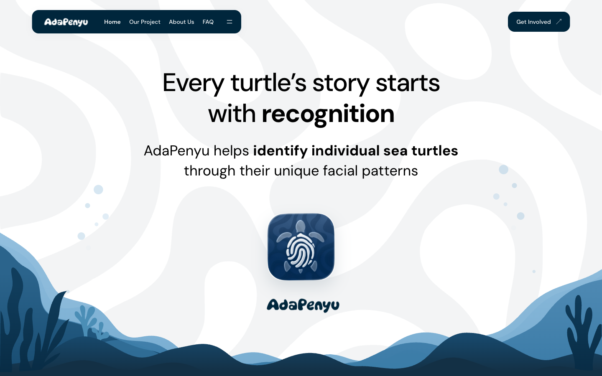

<div align="center">


# AdaPenyu

**Every turtle’s story starts with recognition.**

An ocean-inspired website introducing photo-based sea turtle identification.

[**Visit www.adapenyu.com**](https://www.adapenyu.com)


</div>



## The experience

The site follows a turtle’s story: the identification problem, how facial patterns
can help, the prototype, and the people behind it.

- Layered ocean artwork, swimming turtles, coral sway, and scroll reveals.
- Desktop story sequences with native sticky scrolling; a linear composition on mobile.
- Phone previews that separate as you scroll on larger screens; a swipeable carousel
  with buttons and keyboard controls below 768px.
- A centred mobile navbar with an animated dropdown, member profile dialogs,
  and an animated FAQ.
- Tap the hero's AdaPenyu app icon to open the three original prototype screenshots.
  The popup offers a phone carousel on mobile and a three-screen view on larger displays.
- Keyboard navigation, visible focus states, and a static alternative for reduced motion.

## Design language

The visual system pairs a clean reading layout with playful marine illustrations.
Depth comes from overlapping SVG layers and gradual color changes.

| Color | Role |
| --- | --- |
| `#00263C` | Brand navy, navigation, primary actions |
| `#30526B` | Supporting text and blue accents |
| `#133045` | Deep ocean chapters |
| `#051320` | Ocean floor |
| `#FFFFFF` / `#F3F4F5` | Open space and quiet surfaces |

**Typography:** DM Sans for body and navigation, Manrope for supporting copy,
and DynaPuff for expressive headings. Tailwind utilities define responsive layouts;
shared theme tokens live in `globals.css`.

## Architecture

```text
src/
├── app/
│   ├── (marketing)/        Landing route and brand fonts
│   ├── (workspace)/        Turtle prototypes, login, calendar, and meetings
│   ├── auth/               OAuth callback and code exchange
│   └── api/                Re-identification endpoint placeholder
├── features/
│   ├── marketing/          Sections, artwork, content, and scroll sequences
│   ├── auth/               Google sign-in and sign-out actions
│   ├── schedule/           Calendar, meeting editor, and local storage adapter
│   ├── turtles/            Turtle types, UI, and repository interface
│   └── re-identification/  Upload UI, match types, and model service interface
├── components/             Shared UI and motion helpers
├── utils/supabase/          Browser/server clients and session refresh
├── proxy.ts                Session refresh on protected workspace routes
└── lib/                    Motion settings and site configuration
public/images/              Supplied SVG artwork and ocean-layer metadata
public/icons/               Versioned AdaPenyu browser and touch icons
```

**Motion** handles interface transitions. **GSAP ScrollTrigger** handles coordinated
scroll sequences and ocean depth. Separate wrappers keep idle animation independent
from scroll movement; decorative loops pause offscreen and in hidden tabs.

Domain types and server adapter interfaces keep future storage and model integration
separate from the presentation layer. GitHub pushes to `main` deploy through Vercel.

### Mobile interaction guide

Open the centred navigation button to reveal the chapter links. Escape closes the
dropdown and returns focus to the button; selecting a chapter moves to that section.

The phone carousel supports swiping, previous/next buttons, and direct slide selection.
With the carousel focused, use Left/Right to change slides or Home/End to reach the
first/last screen. It never advances automatically and respects reduced motion.
The hero screenshot popup starts at the first screen each time it opens. Escape or
the close button dismisses it and returns focus to the app icon.

## Run locally

Requires Node.js 22 and pnpm 10.34.6 (pinned in `package.json`).

```bash
pnpm install
pnpm dev
```

Open [localhost:3000](http://localhost:3000). Available checks:

```bash
pnpm lint
pnpm typecheck
pnpm build
```

## Project status

| Route | Purpose | Current access / state |
| --- | --- | --- |
| `/` | Ocean story and prototype presentation | Public |
| `/login` | Google sign-in | Signed-in visitors return to the calendar |
| `/schedule` | Calendar and meeting editor | Verified sign-in required |
| `/meetings` | Searchable meeting list | Verified sign-in required |
| `/identify` | Photo identification preview | Upload and matching are not connected |
| `/turtles` | Turtle catalogue preview | Data source is not connected |

The public website and frontend interactions are implemented. The turtle workspace
is a prototype: uploads, model inference, persistence, and identity review await
integration. The API currently returns `501`; the contact form saves a local draft.
The displayed accuracy figure comes from the supplied prototype design, rather
than an independently reproduced benchmark in this repository.

Maintained by [Gung](https://github.com/gungfebrian).

## Meeting scheduler

Visit `/schedule` or choose **Calendar** in the site navigation. Google login is required.
The navbar has two sections: **Calendar** (`/schedule`) and **Meetings** (`/meetings`).
Meetings shows the same account’s saved meetings as cards with dates, times,
participants, status, and video-call links. Search by title, person, or notes;
sort by date (oldest/newest) or title (A–Z). Filter by All, Upcoming, Past, or
Cancelled, and use Reset to clear the search, filter, and sort. Open
details to edit, cancel, or delete a meeting without leaving the list. Both routes
require verified login.

The calendar opens in month view. Click a date to see its hourly timeline, then
click a half-hour slot to add a meeting. A compact inspector holds the title,
participants, duration, and existing HTTPS video-call link. Add professors,
doctors, or friends inside the inspector, and select one or more participants.

Click a meeting to edit it, open its call link, cancel it, or delete it. Deletion
requires confirmation and offers Undo for the most recent deletion while you stay on the page.
Undo rejects a restored scheduled meeting if its time has since been occupied. The toolbar switches
between month and day, navigates dates, and returns to today. Cancelled meetings
can be shown with the sidebar checkbox or mobile footer control. The interface
uses AdaPenyu’s light ocean identity: DM Sans, a navy wordmark/navigation bar,
the existing organic background pattern, and pale blue calendar surfaces. The
calendar stays light in either device appearance and stacks on mobile. Overlapping
meetings in the organizer’s agenda are rejected. Dates use the device timezone;
timestamps remain UTC. Arrow keys navigate calendar dates; Escape closes details.

This is a local preview. Data is saved under `adapenyu-schedule-v1:<user-id>` in this browser’s
local storage, using a separate key for each verified account. Existing anonymous
preview data is retained but is not automatically assigned to a signed-in user.
It does not send invitations, check participant calendar availability, or create
Google Meet links.

Supabase browser/server clients live in `src/utils/supabase/`. Next.js 16's
`src/proxy.ts` refreshes sessions on auth and schedule routes; the schedule page
also verifies claims on the server. Sign-in uses Google's OAuth flow with a PKCE
code exchange at `/auth/callback`. Sign-out uses a server action. The public
landing page does not require login.

### Enable Google sign-in

1. Copy `.env.example` to `.env.local` and replace both placeholders with your
   Supabase project URL and publishable key. `.env.local` is ignored by Git and
   is not included when cloning this repository.
2. In Supabase **Authentication → Sign In / Providers → Google**, enable Google
   and enter the Google OAuth client ID and secret.
3. In Google Cloud, add your Supabase project's authorized redirect URI:
   `https://<project-ref>.supabase.co/auth/v1/callback`.
4. In Supabase **Authentication → URL Configuration**, add
   `http://localhost:3000/auth/callback` and your deployed site's `/auth/callback`
   URL to the redirect allowlist. Set the Site URL to the deployed site.
5. Set the two public environment variables in the hosting environment as well.
   Restart the dev server after environment changes.

The login page checks Google provider availability and disables sign-in while the
provider is unavailable. No Google secret belongs in a `NEXT_PUBLIC_` variable.

Meeting data still needs database integration. Replace
`src/features/schedule/storage.ts` with authenticated Supabase queries once the
tables exist, and protect all rows with owner-based RLS. Browser storage provides
local previews, not a database authorization boundary. Calendar/Meet creation and
attendee invitations require separate Google API permissions beyond sign-in.
The sample `todos` query was not added because this app has no `todos` feature.

Run scheduler validation checks with Node.js 22.18+:

```bash
node --test tests/*.test.mjs
```
